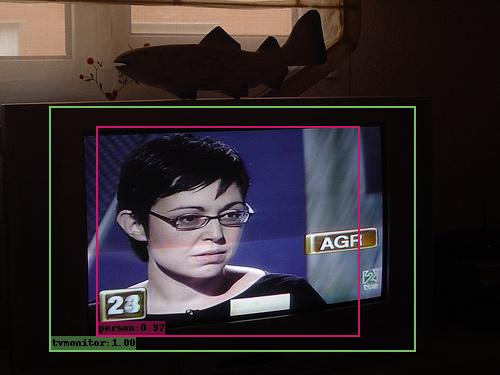

# SSD

[](https://ssd.readthedocs.io/zh_CN/latest/?badge=latest) [](https://github.com/RichardLitt/standard-readme) [](https://conventionalcommits.org) [](http://commitizen.github.io/cz-cli/)

> `SSD`算法实现

在`Github`上找到一个`SSD`目标检测算法实现 - [lufficc/SSD](https://github.com/lufficc/SSD)，这个工程不仅完美的实现了`SSD`算法，而且整体结构清晰，具有高可扩展性。所以新建了一个仓库，一方面是学习`SSD`算法，另一方面是研究整个训练框架，以便于其他算法的实现

|          | VOC07+12(VGG16, 300x300) | FPS | VOC07+12(VGG16, 512x512) | FPS |
|:--------:|:------------------------:|:---:|:------------------------:|:---:|
| 论文实现 |           77.20%          |  46 |          79.80%          |  22 |
|  SSD实现 |          77.45%          | >70 |          80.36%          | ~30 |

<div align=center></div>

<div align=center></div>

## 内容列表

- [背景](#背景)
- [安装](#安装)
- [用法](#用法)
- [主要维护人员](#主要维护人员)
- [致谢](#致谢)
- [参与贡献方式](#参与贡献方式)
- [许可证](#许可证)

## 背景

* [SSD: Single Shot MultiBox Detector](https://arxiv.org/abs/1512.02325)
 
## 安装

### 文档工具安装

```
$ pip install -r requirements.txt
```

## 用法

### 文档浏览

有两种使用方式

1. 在线浏览文档：[SSD](https://ssd.readthedocs.io/zh_CN/latest/)

2. 本地浏览文档，实现如下：

    ```
    $ git clone https://github.com/zjZSTU/SSD.git
    $ cd SSD
    $ mkdocs serve
    ```
    启动本地服务器后即可登录浏览器`localhost:8000`

## 主要维护人员

* zhujian - *Initial work* - [zjZSTU](https://github.com/zjZSTU)

## 致谢

* [lufficc/SSD](https://github.com/lufficc/SSD)

### 引用

```
@misc{liu2015ssd,
    title={SSD: Single Shot MultiBox Detector},
    author={Wei Liu and Dragomir Anguelov and Dumitru Erhan and Christian Szegedy and Scott Reed and Cheng-Yang Fu and Alexander C. Berg},
    year={2015},
    eprint={1512.02325},
    archivePrefix={arXiv},
    primaryClass={cs.CV}
}

@misc{pascal-voc-2007,
	author = "Everingham, M. and Van~Gool, L. and Williams, C. K. I. and Winn, J. and Zisserman, A.",
	title = "The {PASCAL} {V}isual {O}bject {C}lasses {C}hallenge 2007 {(VOC2007)} {R}esults",
	howpublished = "http://www.pascal-network.org/challenges/VOC/voc2007/workshop/index.html"}

@misc{pascal-voc-2012,
	author = "Everingham, M. and Van~Gool, L. and Williams, C. K. I. and Winn, J. and Zisserman, A.",
	title = "The {PASCAL} {V}isual {O}bject {C}lasses {C}hallenge 2012 {(VOC2012)} {R}esults",
	howpublished = "http://www.pascal-network.org/challenges/VOC/voc2012/workshop/index.html"}
```

## 参与贡献方式

欢迎任何人的参与！打开[issue](https://github.com/zjZSTU/SSD/issues)或提交合并请求。

注意:

* `GIT`提交，请遵守[Conventional Commits](https://www.conventionalcommits.org/en/v1.0.0-beta.4/)规范
* 语义版本化，请遵守[Semantic Versioning 2.0.0](https://semver.org)规范
* `README`编写，请遵守[standard-readme](https://github.com/RichardLitt/standard-readme)规范

## 许可证

[Apache License 2.0](LICENSE) © 2020 zjZSTU
