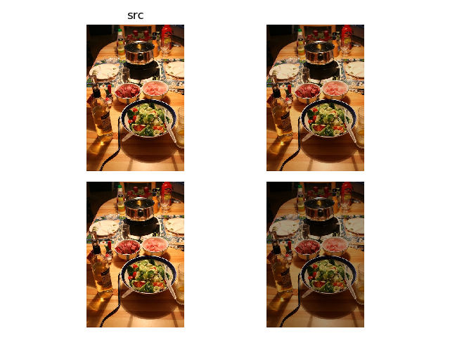
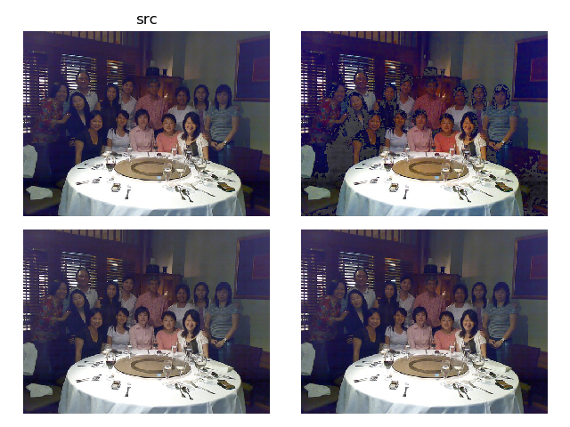
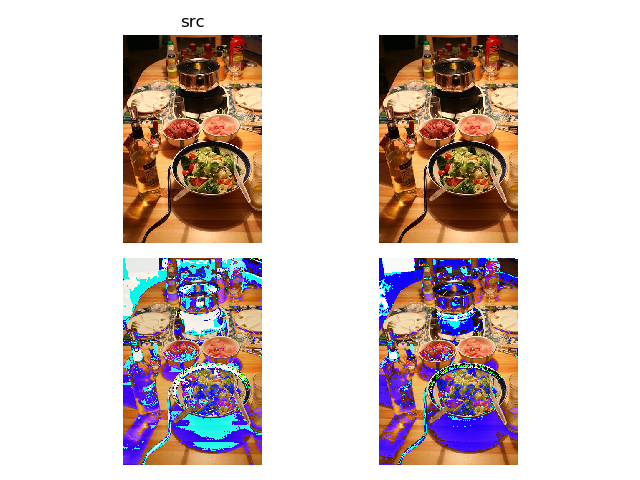
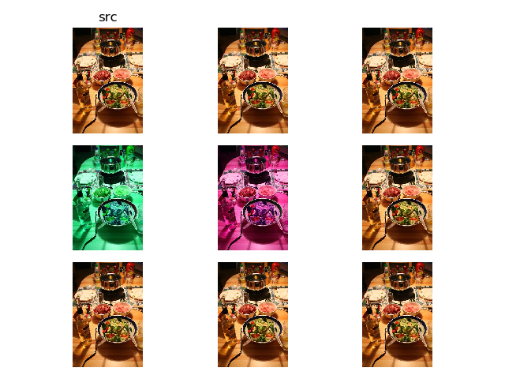

# 光度扭曲

光度扭曲（`Photometric Distort`）包含了多个颜色通道的实现：

1. 对比度（`RGB`）
2. 饱和度（`S`）
3. 色度（`H`）

以及随机亮度和噪声的增加

## 图像格式转换

* `py/ssd/data/transforms/color/convert_color.py`

使用`cv2`进行图像`RGB、BGR、HSV`格式之间的转换

## 随机对比度

* `py/ssd/data/trsnforms/color/random_contrast`

使用随机乘法因子（[0.5, 1.5]）调整像素值

## 随机饱和度

* `py/ssd/data/transforms/color/random_saturation.py`

使用随机乘法因子[0.5, 1.5]调整图像的饱和度通道

## 随机色度

* `py/ssd/data/transforms/color/random_hue.py`

设置一个加法因子`delta`（取值在`[0, 360]`），调整图像的色度通道

## 随机亮度

* `py/ssd/data/transforms/color/random_brightness.py`

设置一个加法因子`delta`（取值在`[0, 255]`），调整图像的像素值

## 随机噪声

* `py/ssd/data/transforms/color/random_lighting_noise.py`
*  `py/ssd/data/transforms/color/swap_channels.py`

随机交换`RGB`各通道

## 亮度和对比度的差别

参考：

[对比度](https://baike.baidu.com/item/%E5%AF%B9%E6%AF%94%E5%BA%A6)

[亮度](https://baike.baidu.com/item/%E4%BA%AE%E5%BA%A6)

* 对比度指的是一幅图像中明暗区域最亮的白和最暗的黑之间不同亮度层级的测量，差异范围越大代表对比越大，差异范围越小代表对比越小
* 亮度也称明度，表示色彩的明暗程度

## 饱和度和色度的差别

参考：

[饱和度](https://baike.baidu.com/item/%E9%A5%B1%E5%92%8C%E5%BA%A6/3430026)

[色度](https://baike.baidu.com/item/%E8%89%B2%E5%BA%A6)

[HSV](https://baike.baidu.com/item/HSV/547122)

* 饱和度是指色彩的鲜艳程度，也称色彩的纯度。饱和度取决于该色中含色成分和消色成分（灰色）的比例。含色成分越大，饱和度越大；消色成分越大，饱和度越小
* 颜色是由亮度和色度共同表示的，色度是不包括亮度在内的颜色的性质，它反映的是颜色的色调和饱和度

## 光度扭曲实现

* `py/ssd/data/transforms/color/random_brightness.py`
* `py/ssd/data/transforms/compose.py`

通过`Compose`结构级联所有的颜色操作

