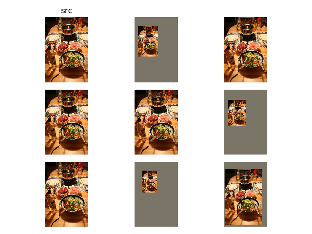

# 图像扩展

* `py/ssd/data/transforms/expand.py`

其目的在于缩放图像大小，同时保证边界框坐标的缩放

## 设置缩放因子

选择一个随机数`[1, 4]`作为图像缩放因子，同时设置缩放图像在新图像中的左上角位置`(left, top)`

## 像素填充

缩放后的图像其他位置由预先设置的像素值进行填充，当前设置为像素均值

```
# Values to be used for image normalization, RGB layout
_C.INPUT.PIXEL_MEAN = [123, 117, 104]
# 新建Expand对象
model = Expand(cfg.INPUT.PIXEL_MEAN)
```

## 示例


