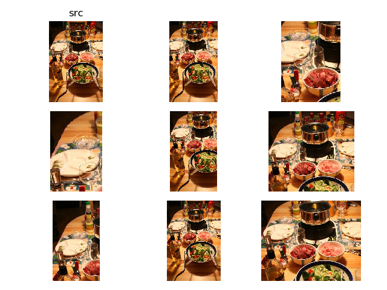

# 随机裁剪

* `py/ssd/data/transforms/random_sample_crop.py`

对图像进行随机裁剪操作

## 实现流程

其实现比较复杂，因为需要考虑到相应的标注边界框的计算。实现流程如下：

1. 计算随机裁剪的宽/高。符合以下要求
      1. 裁剪宽的取值为`[0.3*width, width]`
      2. 裁剪高的取值为`[0.3*height, height]`
      3. 高/宽比例（`h/w`）在(`0.5, 2`)之间
2. 计算随机裁剪的左上角坐标
3. 计算裁剪边界框和标注边界框的`IoU`。符合以下要求
      1. 设置了`5`个最小`IoU([0.1, 0.3, 0.7, 0.9, None])`
      2. 每次随机选择一个最小`IoU`，如果为`None`，则直接返回原图
4. 计算标注边界框是否位于裁剪图像中。如果其标注边界框中心位于裁剪图像，则进一步计算其长宽

## 示例

