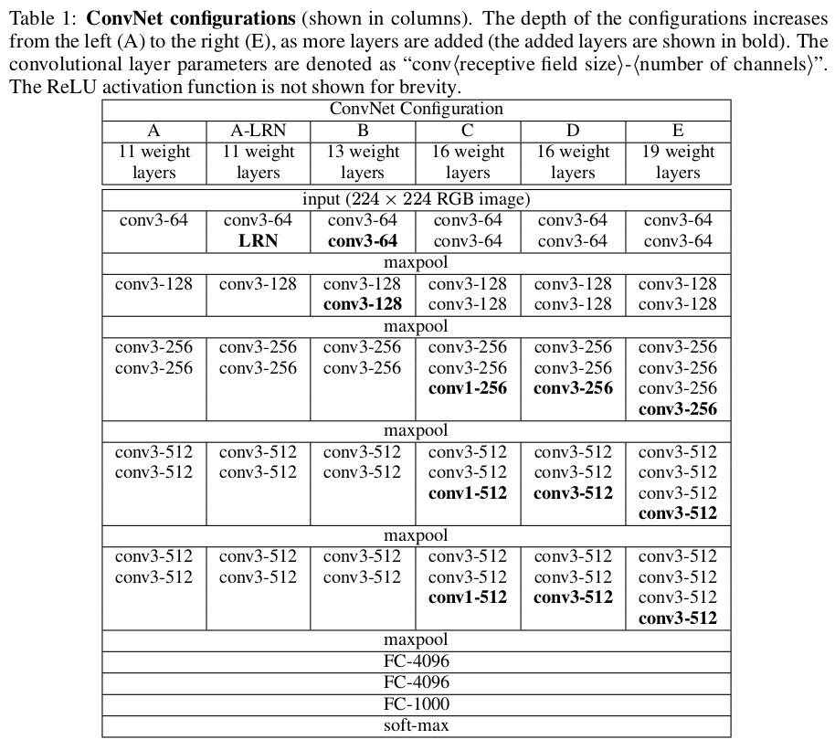
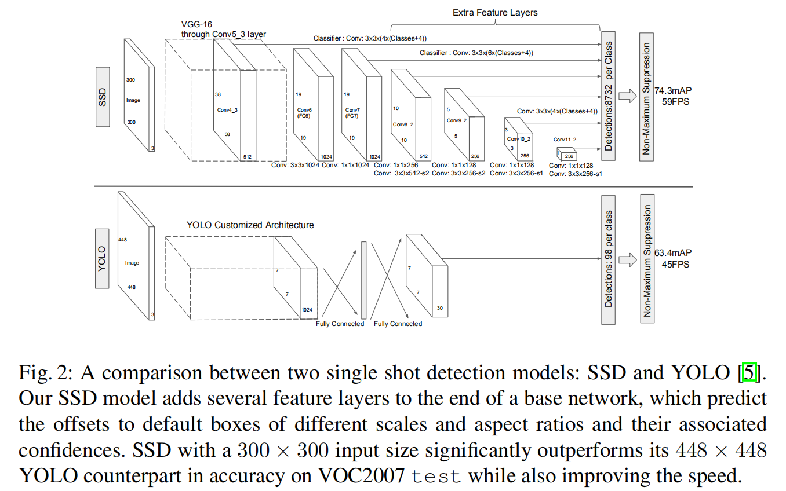

# 基础网络

使用`VGG16`作为基础网络进行特征提取。关于`VGG16`实现细节参考[用于大尺度图像分类的极深卷积网络](https://blog.zhujian.life/posts/2738b55.html)



**使用`VGG16-D`作为基础网络**

### 论文内容

* `3. Experimental Results`
* `3.1 PASCAL  VOC2007`

## 网络调整



前`5`个卷积模块保持不变

```
[64, 64, 'M', 128, 128, 'M', 256, 256, 256, 'C', 512, 512, 512, 'M', 512, 512, 512],
```

后续修改如下：

* 将最后一个池化层（`pool5`）从$2\times 2-s2$修改为$3\times 3-s1$
* 将第一个和第二个全连接层（`fc6`和`fc7`）修改为卷积操作
    * `Conv6`：$3\times 3\times 1024, S=2$
    * `Conv7`：$1\times 1\times 1024$
* 取消最后一个全连接层（`fc8`）和所有的随机失活操作
* 在`Conv7`之后添加`4`个卷积模块
    * `Conv8`：先执行$1\times 1\times 256$，再执行$3\times 3\times 512 - s2$
    * `Conv9`：先执行$1\times 1\times 128$,再执行$3\times 3\times 256-s2$
    * `Conv10`：先执行$1\times 1\times 128$,再执行$3\times 3\times 256-s1$
    * `Conv11`：先执行$1\times 1\times 128$,再执行$3\times 3\times 256-s1$

## 特征层

分别取以下网络层作为特征层:

* `conv4_3`：$38\times 38\times 512$
* `conv7(fc7)`：$19\times 19\times 1024$
* `conv8_2`：$10\times 10\times 512$
* `conv9_2`：$5\times 5\times 256$
* `conv10_2`：$3\times 3\times 256$
* `conv11_2`：$1\times 1\times 256$

## 具体实现

* `py/ssd/models/backbone/vgg.py`

添加了以下实现

1. 对`Conv4_3`特征层，额外进行了`L2 Norm`操作
2. 对`Conv6`，使用了空洞卷积