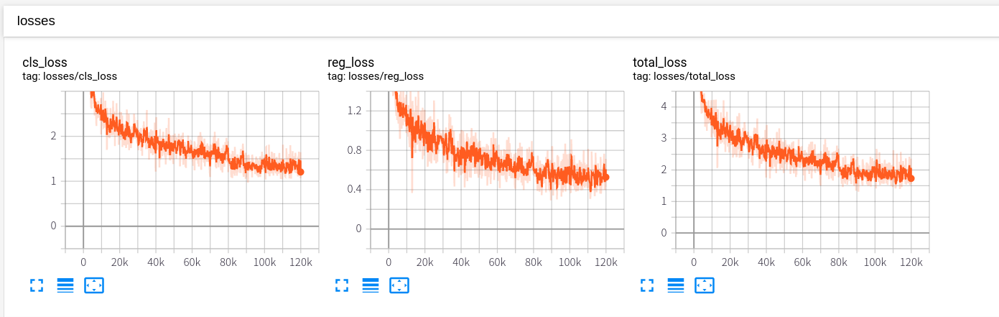
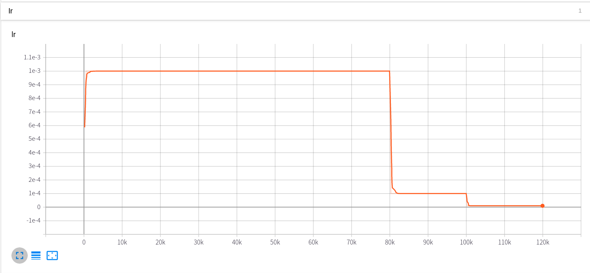
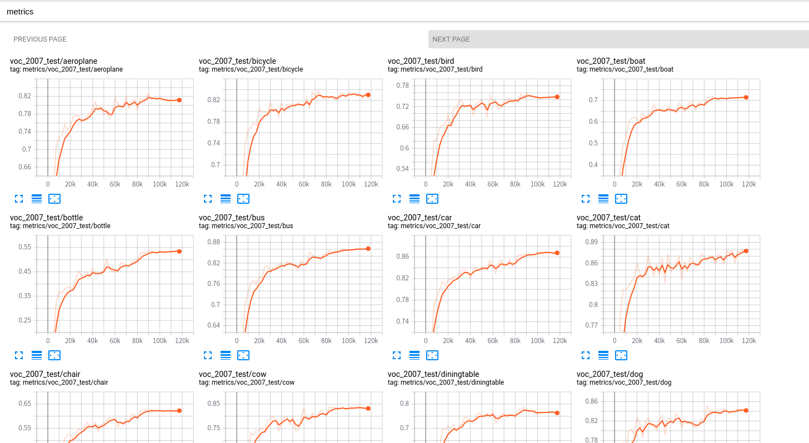

# 训练日志

## 训练结果







## 训练日志

```
$ python train.py --config-file configs/vgg_ssd300_voc0712.yaml 
2020-05-16 11:10:04,780 SSD INFO: Using 1 GPUs
2020-05-16 11:10:04,780 SSD INFO: Namespace(config_file='configs/vgg_ssd300_voc0712.yaml', distributed=False, eval_step=2500, local_rank=0, log_step=10, num_gpus=1, opts=[], save_step=2500, skip_test=False, use_tensorboard=True)
2020-05-16 11:10:04,780 SSD INFO: Loaded configuration file configs/vgg_ssd300_voc0712.yaml
2020-05-16 11:10:04,780 SSD INFO: 
MODEL:
  NUM_CLASSES: 21
INPUT:
  IMAGE_SIZE: 300
DATASETS:
  TRAIN: ("voc_2007_trainval", "voc_2012_trainval")
  TEST: ("voc_2007_test", )
SOLVER:
  MAX_ITER: 120000
  LR_STEPS: [80000, 100000]
  GAMMA: 0.1
  BATCH_SIZE: 32
  LR: 1e-3

OUTPUT_DIR: 'outputs/vgg_ssd300_voc0712'
2020-05-16 11:10:04,781 SSD INFO: Running with config:
DATASETS:
  TEST: ('voc_2007_test',)
  TRAIN: ('voc_2007_trainval', 'voc_2012_trainval')
DATA_LOADER:
  NUM_WORKERS: 8
  PIN_MEMORY: True
INPUT:
  IMAGE_SIZE: 300
  PIXEL_MEAN: [123, 117, 104]
MODEL:
  BACKBONE:
    NAME: vgg
    OUT_CHANNELS: (512, 1024, 512, 256, 256, 256)
    PRETRAINED: True
  BOX_HEAD:
    NAME: SSDBoxHead
    PREDICTOR: SSDBoxPredictor
  CENTER_VARIANCE: 0.1
  DEVICE: cuda
  META_ARCHITECTURE: SSDDetector
  NEG_POS_RATIO: 3
  NUM_CLASSES: 21
  PRIORS:
    ASPECT_RATIOS: [[2], [2, 3], [2, 3], [2, 3], [2], [2]]
    BOXES_PER_LOCATION: [4, 6, 6, 6, 4, 4]
    CLIP: True
    FEATURE_MAPS: [38, 19, 10, 5, 3, 1]
    MAX_SIZES: [60, 111, 162, 213, 264, 315]
    MIN_SIZES: [30, 60, 111, 162, 213, 264]
    STRIDES: [8, 16, 32, 64, 100, 300]
  SIZE_VARIANCE: 0.2
  THRESHOLD: 0.5
OUTPUT_DIR: outputs/vgg_ssd300_voc0712
SOLVER:
  BATCH_SIZE: 32
  GAMMA: 0.1
  LR: 0.001
  LR_STEPS: [80000, 100000]
  MAX_ITER: 120000
  MOMENTUM: 0.9
  WARMUP_FACTOR: 0.3333333333333333
  WARMUP_ITERS: 500
  WEIGHT_DECAY: 0.0005
TEST:
  BATCH_SIZE: 10
  CONFIDENCE_THRESHOLD: 0.01
  MAX_PER_CLASS: -1
  MAX_PER_IMAGE: 100
  NMS_THRESHOLD: 0.45
2020-05-16 11:10:14,710 SSD.trainer INFO: No checkpoint found.
2020-05-16 11:10:14,970 SSD.trainer INFO: Start training ...
2020-05-16 11:10:43,388 SSD.trainer INFO: iter: 000010, lr: 0.00035, total_loss: 20.884 (20.884), reg_loss: 3.032 (3.032), cls_loss: 17.852 (17.852), time: 2.668 (2.668), eta: 3 days, 16:54:42, mem: 8288M
2020-05-16 11:10:49,240 SSD.trainer INFO: iter: 000020, lr: 0.00036, total_loss: 15.886 (18.385), reg_loss: 2.946 (2.989), cls_loss: 12.940 (15.396), time: 0.585 (1.626), eta: 2 days, 6:12:16, mem: 8288M
2020-05-16 11:10:55,108 SSD.trainer INFO: iter: 000030, lr: 0.00037, total_loss: 15.040 (17.270), reg_loss: 2.730 (2.903), cls_loss: 12.310 (14.367), time: 0.587 (1.280), eta: 1 day, 18:39:04, mem: 8288M
2020-05-16 11:11:00,976 SSD.trainer INFO: iter: 000040, lr: 0.00039, total_loss: 14.594 (16.601), reg_loss: 2.765 (2.868), cls_loss: 11.829 (13.733), time: 0.587 (1.107), eta: 1 day, 12:52:26, mem: 8288M
2020-05-16 11:11:06,836 SSD.trainer INFO: iter: 000050, lr: 0.00040, total_loss: 13.840 (16.049), reg_loss: 2.842 (2.863), cls_loss: 10.998 (13.186), time: 0.586 (1.002), eta: 1 day, 9:24:06, mem: 8288M
2020-05-16 11:11:12,690 SSD.trainer INFO: iter: 000060, lr: 0.00041, total_loss: 11.895 (15.357), reg_loss: 2.800 (2.853)
。。。
。。。
2020-05-17 07:20:21,323 SSD.trainer INFO: iter: 119940, lr: 0.00001, total_loss: 1.961 (2.557), reg_loss: 0.593 (0.754), cls_loss: 1.368 (1.803), time: 0.589 (0.605), eta: 0:00:36, mem: 8288M
2020-05-17 07:20:27,208 SSD.trainer INFO: iter: 119950, lr: 0.00001, total_loss: 1.739 (2.557), reg_loss: 0.511 (0.754), cls_loss: 1.227 (1.803), time: 0.588 (0.605), eta: 0:00:30, mem: 8288M
2020-05-17 07:20:33,106 SSD.trainer INFO: iter: 119960, lr: 0.00001, total_loss: 1.777 (2.557), reg_loss: 0.488 (0.753), cls_loss: 1.289 (1.803), time: 0.590 (0.605), eta: 0:00:24, mem: 8288M
2020-05-17 07:20:38,987 SSD.trainer INFO: iter: 119970, lr: 0.00001, total_loss: 1.709 (2.557), reg_loss: 0.463 (0.753), cls_loss: 1.246 (1.803), time: 0.588 (0.605), eta: 0:00:18, mem: 8288M
2020-05-17 07:20:44,867 SSD.trainer INFO: iter: 119980, lr: 0.00001, total_loss: 1.843 (2.557), reg_loss: 0.528 (0.753), cls_loss: 1.315 (1.803), time: 0.588 (0.605), eta: 0:00:12, mem: 8288M
2020-05-17 07:20:50,752 SSD.trainer INFO: iter: 119990, lr: 0.00001, total_loss: 1.918 (2.557), reg_loss: 0.546 (0.753), cls_loss: 1.371 (1.803), time: 0.588 (0.605), eta: 0:00:06, mem: 8288M
2020-05-17 07:20:56,633 SSD.trainer INFO: iter: 120000, lr: 0.00001, total_loss: 1.885 (2.557), reg_loss: 0.529 (0.753), cls_loss: 1.356 (1.803), time: 0.588 (0.605), eta: 0:00:00, mem: 8288M
2020-05-17 07:20:57,016 SSD.trainer INFO: Saving checkpoint to outputs/vgg_ssd300_voc0712/model_120000.pth
2020-05-17 07:20:57,186 SSD.trainer INFO: Saving checkpoint to outputs/vgg_ssd300_voc0712/model_final.pth
2020-05-17 07:20:57,302 SSD.trainer INFO: Total training time: 20:10:40 (0.6053 s / it)
2020-05-17 07:20:57,314 SSD INFO: Start evaluating...
2020-05-17 07:20:57,316 SSD.inference INFO: Evaluating voc_2007_test dataset(4952 images):
100%|████████████████████████████████████████████████████████████████████████████████████████████████████████████████████████████████████████████████████████████████████████████| 496/496 [00:40<00:00, 12.34it/s]
2020-05-17 07:21:39,792 SSD.inference INFO: mAP: 0.7740
aeroplane       : 0.8113
bicycle         : 0.8322
bird            : 0.7476
boat            : 0.7160
bottle          : 0.5331
bus             : 0.8619
car             : 0.8669
cat             : 0.8781
chair           : 0.6243
cow             : 0.8297
diningtable     : 0.7607
dog             : 0.8393
horse           : 0.8634
motorbike       : 0.8420
person          : 0.7972
pottedplant     : 0.5075
sheep           : 0.7754
sofa            : 0.7775
train           : 0.8548
tvmonitor       : 0.7622
```